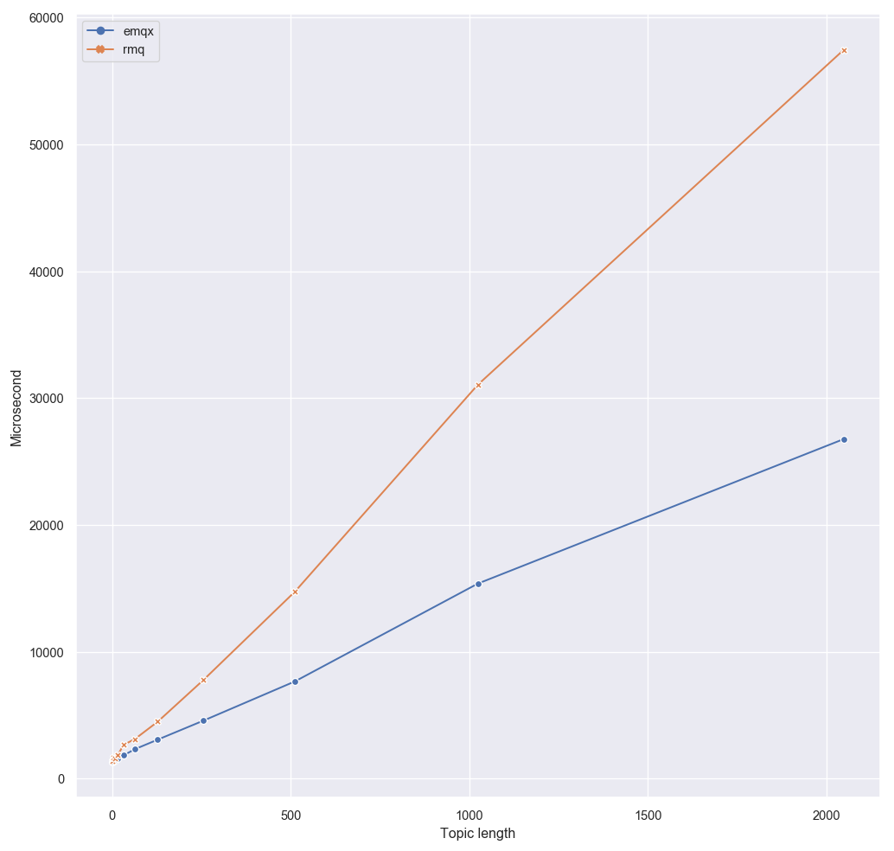

mqtt_routing_perf_test
======================

Test app for MQTT routing performance.

Build
-----

    $ rebar3 compile

Use
---

1. Start MQTT server
2. Start application

        $ rebar3 shell

3. Wait until test is over
4. Application dumps gathered stats into `priv/stats.csv`. Output format can be seen in an example [emqx_stats.csv](priv/emqx_stats.csv).
5. Generate graph based on available data using notebook [MQTT roundtrip time.ipynb](./MQTT roundtrip time.ipynb).

    
